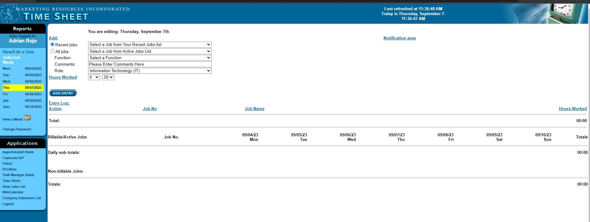
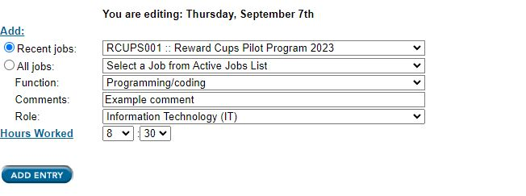

# MRI-Timesheet User Documentation

## 1. Introduction

Welcome to the MRI Timesheet documentation. This document is designed to help Users understand how to use the MRI Timesheet function. Timesheets are a crucial tool for tracking and managing your work hours, and this guide will walk you through the entire process.

## 2. User Flow

### 2.1 Initial Landing Page

To begin using the MRI Timesheet, follow these steps:

1. Go to the MRI homepage: [https://apps.marketingresources.com/](https://apps.marketingresources.com/)
2. Ensure that you are logged in and authenticated.

### 2.2 Navigate to Timesheet Page

Once you are logged in, navigate to the Timesheet page by following these steps:

1. Click on the "Timesheet" link located on the left side of the screen.
2. Direct URL: [https://apps.marketingresources.com/timesheet](https://apps.marketingresources.com/timesheet)

### 2.3 Timesheet Form Entry

On the Timesheet page, you will find a form for entering your timesheet information. Here's how to fill it out:

#### 3.1 Select a Job

Start by selecting the job for which you want to record your hours. You can choose from the following options:
- Select a Job from Your Recent Jobs list.
- Select a Job from the Active Jobs List.

#### 3.2 Select Function

After selecting a job, specify the function or task related to the selected job.

#### 3.3 Enter Comments (Optional)

You have the option to enter any comments or notes related to the work you performed. This field is optional.

#### 3.4 Select Department

Select your department or role within the organization from the available options.

#### 3.5 Enter Hours and Minutes Worked

Input the number of hours and minutes you worked on the specified job.

### 2.4 Submit Timesheet Entry

#### 4.1 Review Entries

Before submitting, review all the information you entered in the timesheet form to ensure accuracy.

#### 4.2 Submit Timesheet

Once you are satisfied with the entered information, click the "Add Entry" button to submit your timesheet entry.

## 3. Timesheet Entry Form

The `Timesheet entry form` allows you to submit your timesheet entries. When you submit, the `hours` and `minutes` values are used to update the timesheet table at the bottom of the screen. 

### 3.1 Form Inputs

The timesheet entry form includes the following inputs:

1. **Recent Job List**

   This section generates a list of your 20 most recent job entries. It is retrieved from an SQL Query.

2. **Active Job List**

   Choose from a list of active jobs at MRI. This list is also generated from an SQL Query.

3. **Function**

   Select the specific function related to the job you have chosen.

4. **Comments (Optional)**

   Include additional notes or comments related to your timesheet entry.

5. **Role**

   Select your department or role within the organization.

6. **Hours Worked**

   Input the number of hours worked for the selected job.

## 4. Multiple Entries Per Day

You are allowed to submit more than one timesheet entry per day. This flexibility enables you to record your work for various jobs and functions as needed. Simply follow the same steps outlined in the user flow to submit additional entries.

Thank you for using the MRI Timesheet function. If you have any further questions or encounter any issues, please contact our support team for assistance.