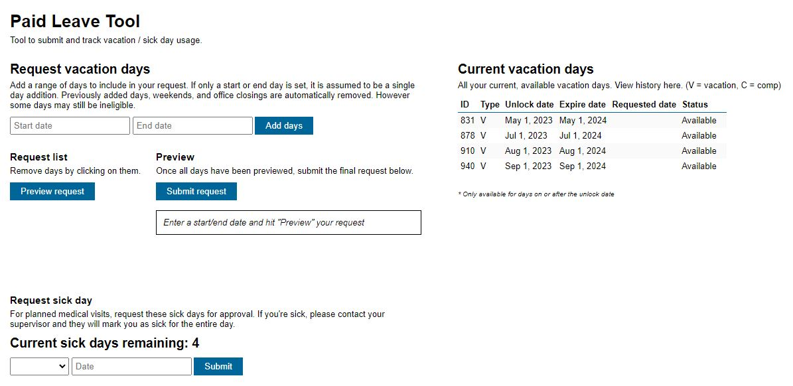

Vacation Tracker User Guide
This user guide provides instructions on how to use MRi's Vacation Tracker application. With the Vacation Tracker, you can plan and manage your vacation, sick days, and other time-off requests.

Accessing Vacation Tracker
To access the Vacation Tracker, follow these steps:

Log In: Visit the login page of the Vacation Tracker application and enter your credentials to log in.

Dashboard: After logging in, you will be directed to the dashboard, where you can view your vacation and time-off balances, as well as access various features of the Vacation Tracker.

Planning Your Time Off
Viewing Your Balances
--- 
In the dashboard, you can view your available vacation days, sick days, and other time-off balances. These balances are displayed for the current year and, if available, the next year.

Requesting Time Off
--- 
To request time off (e.g., vacation, sick day), follow these steps:

Select Dates:

Click on the input boxes to choose the start and end dates for your time-off request.
Choose the type of time off you are requesting (e.g., Vacation) 

Add Request:

Click the "Add days" button to send your time-off request for approval.

Managing Your Requests
You can manage your submitted time-off requests in the Vacation Tracker. Here's how:

Sick Days
You can record sick days using the Vacation Tracker:

Sick Day Selection:

Select the type of sick day (e.g., AM, PM, FULL) from the dropdown menu.
Submit:

Click the "Submit" button to record your sick day.

 